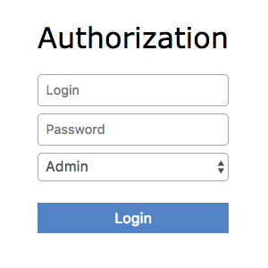
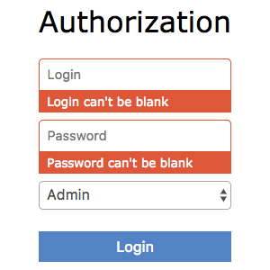

# Auther

Provides simple, form-based authentication for apps that need security but don't want to deal with
the clunky UI of HTTP Basic Authentication or something as heavyweight as
[Devise](https://github.com/plataformatec/devise). It doesn't require a database and is compatible
with password managers like [1Password](https://agilebits.com/onepassword) making for a pleasant
user experience.

<!-- Tocer[start]: Auto-generated, don't remove. -->

## Table of Contents

  - [Features](#features)
  - [Requirements](#requirements)
  - [Setup](#setup)
  - [Usage](#usage)
    - [Initializer](#initializer)
    - [Routes](#routes)
    - [Model](#model)
    - [Presenter](#presenter)
    - [View](#view)
    - [Controller](#controller)
    - [Logging](#logging)
    - [Troubleshooting](#troubleshooting)
  - [Tests](#tests)
  - [Versioning](#versioning)
  - [Code of Conduct](#code-of-conduct)
  - [Contributions](#contributions)
  - [License](#license)
  - [History](#history)
  - [Credits](#credits)

<!-- Tocer[finish]: Auto-generated, don't remove. -->

## Features

- Supports form-based authentication compatible with password managers like
  [1Password](https://agilebits.com/onepassword).

- Uses CSS Flexbox for lightweight styling.
- Uses encrypted account credentials to keep sensitive information secure.
- Supports multiple accounts with optional path exclude lists.
- Supports customizable routes, models, presenters, views, controllers, and loggers.
- Provides a generator for easy install and setup within an existing project.
- Provides auto-redirection to requested path for verified credentials.

## Requirements

0. [Ruby 2.5.x](https://www.ruby-lang.org).
0. [Ruby on Rails 5.x.x](http://rubyonrails.org).

## Setup

Type the following to install:

    gem install auther

Add the following to your Gemfile:

    gem "auther"

Run the generator to configure and initialize your application:

    rails generate auther:install

## Usage

Assuming you are using something like [direnv](https://direnv.net), add the following to your
`.envrc` file:

    AUTHER_SECRET=281047a438dcd3f1f1401954d779025e496dc938ba79703bcf6ca0605ca350e7
    AUTHER_ADMIN_LOGIN=V0lMaDFBK2o3SngvSHUySUZOYVJ3dC82QmlQaDRWcUhKOEFkUjFsYkF3ND0tLXpMZDBhdCtJaHVsVnpWNkFWVWUxVVE9PQ==--d8595331720f8475090763d5a3a3103b3f6a9259
    AUTHER_ADMIN_PASSWORD=Tk05VzlWNTdoQW5sbEtzWlA5T25VVHRFb3FkS0xGbjA2ZVU5bjVqN3RHST0tLVBOaVcyWnp3ZFY5ais0eWtrNXhobXc9PQ==--a83d6d7644085a972d847181b5f486bf245fd16b

Launch your Rails application and visit the following:

    http://localhost:3000/login

Use these credentials to login:

- Login: test@test.com
- Password: nevermore

That's it, you'll be logged in at this point.

### Initializer

The initializer (installed during setup) can be found here:

    config/initializers/auther.rb

The initializer comes installed with the following settings:

    Rails.application.config.auther_settings = {
      accounts: [
        name: "admin",
        encrypted_login: ENV["AUTHER_ADMIN_LOGIN"],
        encrypted_password: ENV["AUTHER_ADMIN_PASSWORD"],
        paths: ["/admin"]
      ],
      secret: [ENV["AUTHER_SECRET"]].pack("H*")
    }

**IMPORTANT**: The encrypted secret, login, and password used in the `.envrc` setup above must be
unique and re-encrypted before deploying to production (don't use the provided examples)! To
encrypt/decrypt account credentials, launch a rails console and run the following:

    # Best if generated via `SecureRandom.hex 32`. Exactly `32` bytes is required or you'll
    # get a `ArgumentError: key must be 32 bytes`. Must be equal to the secret as defined in
    # `auther_settings`.
    cipher = Auther::Cipher.new "f106a7169a5cfb90f016105b31b595282011a1090d843b7868103c770e35e38e"

    # Use the following to encrypt an unecrypted value.
    cipher.encrypt "test@test.com"

    # Use the following to decrypt an encrypted value.
    cipher.decrypt "cEgyd2hHSit6NkpwN000aUNiU3BkNThxcjRRd1AyT1RmbFFqaGJRR0FjVT0tLWR6Mm1sUmxscHlxQU1leHF2d3ZoZ2c9PQ==--6d4b8bfadc54bfba6a41164675b14980caf01445"

The initializer can be customized as follows:

- *title* - Optional. The HTML page title (as rendered within a browser tab). Default:
  "Authorization".
- *label* - Optional. The page label (what would appear above the form). Default: "Authorization".
- *secret* - Required. The secret passphrase used to encrypt/decrypt account credentials.
- *accounts* - Required. The array of accounts with different or similar access to the application.
  - *name* - Required. The account name that uniquely identifies the account.
  - *encrypted_login* - Required. The encrypted account login.
  - *encrypted_password* - Required. The encrypted account password.
  - *paths* - Required. The array of excluded paths for which only this account has access to.
  - *authorized_url* - Optional. The URL to redirect to upon successful authorization. Authorized
    redirection works in the order defined:
    - The excluded path (if requested prior to authorization but now authorized).
    - The authorized URL (if defined and the excluded path wasn't requested).
    - The root path (if none of the above).
  - *deauthorized_url* - Optional. The URL to redirect to upon successful deauthorization (i.e.
    logout). Deauthorized redirections works as follows (in the order defined):
    - The deauthorized URL (if defined).
    - The auth URL.
- *auth_url* - Optional. The URL to redirect to when enforcing authentication. Default: “/login”.
- *logger* - Optional. The logger used to log path/account authorization messages. Default:
  `Auther::NullLogger`.

### Routes

The routes can be customized as follows (installed, by default, via the install generator):

    Rails.application.routes.draw do
      mount Auther::Engine => "/auther"
      get "/login", to: "auther/session#new", as: "login"
      delete "/logout", to: "auther/session#destroy", as: "logout"
    end

### Model

The [Auther::Account](app/models/auther/account.rb) is a plain old Ruby object that uses ActiveModel
validations to aid in attribute validation. This model could potentially be replaced with a
database-backed object (would require controller customization)...but you should question if you
have outgrown the use of this gem and need a different solution altogether if it comes to that.

### Presenter

The [Auther::Presenter::Account](app/presenters/auther/account.rb) is a plain old Ruby object that
uses ActiveModel validations to aid in form validation. This presenter makes it easy to construct
form data for input and validation.

### View

The view can be customized by creating the following file within your Rails application (assumes
that the default Auther::SessionController implementation is sufficient):

    app/views/auther/session/new.html

The form uses the `@account` instance variable which is an instance of the
Auther::Presenter::Account presenter (as mentioned above). The form can be stylized by modifying the
styles found in the [auther.scss](app/assets/stylesheets/auther/auther.scss) stylesheet.

### Controller

The [Auther::SessionController](app/controllers/auther/session_controller.rb) inherits from the
[Auther::BaseController](app/controllers/auther/base_controller.rb). To customize, it is recommended
that you add a controller to your app that inherits from the Auther::BaseController. Example:

    # Example Path:  app/controllers/session_controller.rb
    class SessionController < Auther::BaseController
      layout "example"
    end

This allows customization of session controller behavior to serve any special business needs. See
the `Auther::BaseController` for additional details or the `Auther::SessionController` for default
implementation.

### Logging

As mentioned in the setup above, the logger can be customized as follows:

    Auther::NullLogger.new # This is the default logger (which is no logging at all).
    ActiveSupport::Logger.new("log/#{Rails.env}.log") # Can be used to log to the environment log.
    Logger.new(STDOUT) # Can be used to log to standard output.

When logging is enabled, you'll be able to see the following information in the server logs to help
debug custom Auther settings:

- Requested path and excluded path detection.
- Finding (or not finding) of account.
- Account authentication pass/fail.
- Account and path authorization pass/fail.

### Troubleshooting

- If upgrading Rails, changing the cookie/session settings, generating a new secret base key, etc.
  this might cause Auther authentication to fail. Make sure to clear your browser cookies in this
  situation or use Google Chrome (incognito mode) to verify.
- If the authentication view/form looks broken (stylewise) this could be due to custom
  `ActionView::Base.field_error_proc` settings defined by your app (usually via an initializer).
  Auther uses this configuration `ActionView::Base.field_error_proc = proc { |html_tag, _|
  html_tag.html_safe }` so that no additional markup is added to the DOM when errors are raised. If
  you have customized this to something else, you might want to read the usage documentation
  (mentioned above) to rebuild the authentication view/form for your specific business needs.

## Tests

To test, run:

    bundle exec rake

## Versioning

Read [Semantic Versioning](http://semver.org) for details. Briefly, it means:

- Major (X.y.z) - Incremented for any backwards incompatible public API changes.
- Minor (x.Y.z) - Incremented for new, backwards compatible, public API enhancements/fixes.
- Patch (x.y.Z) - Incremented for small, backwards compatible, bug fixes.

## Code of Conduct

Please note that this project is released with a [CODE OF CONDUCT](CODE_OF_CONDUCT.md). By
participating in this project you agree to abide by its terms.

## Contributions

Read [CONTRIBUTING](CONTRIBUTING.md) for details.

## License

Copyright 2014 [Alchemists](https://www.alchemists.io).
Read [LICENSE](LICENSE.md) for details.

## History

Read [CHANGES](CHANGES.md) for details.
Built with [Gemsmith](https://github.com/bkuhlmann/gemsmith).

## Credits

Developed by [Brooke Kuhlmann](https://www.alchemists.io) at
[Alchemists](https://www.alchemists.io).
