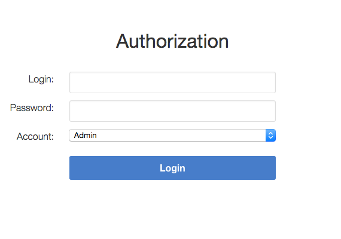
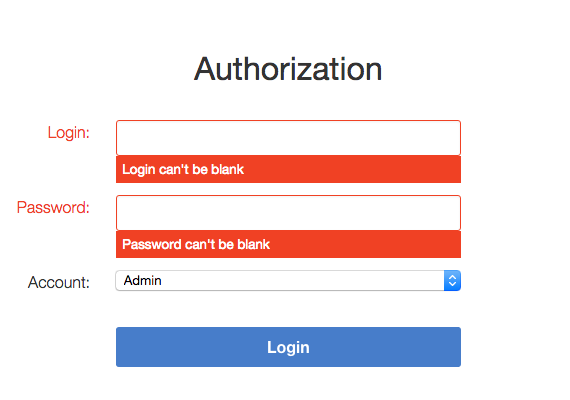
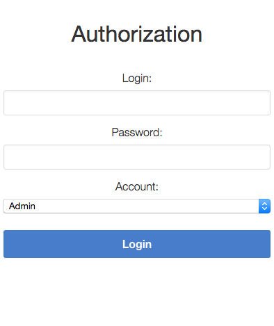
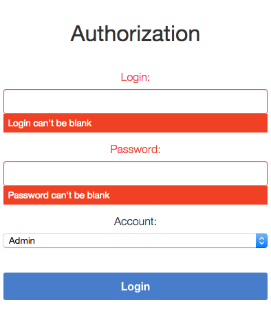

# Auther

Provides simple, form-based authentication for apps that need security but don't want to deal with the clunky UI
of HTTP Basic Authentication or something as heavyweight as [Devise](https://github.com/plataformatec/devise). It
doesn't require a database and is compatible with password managers like [1Password](https://agilebits.com/onepassword)
making for a pleasent user experience.

<!-- Tocer[start]: Auto-generated, don't remove. -->

# Table of Contents

- [Features](#features)
- [Requirements](#requirements)
- [Setup](#setup)
- [Usage](#usage)
  - [Initializer](#initializer)
  - [Routes](#routes)
  - [Model](#model)
  - [Presenter](#presenter)
  - [View](#view)
  - [Controller](#controller)
  - [Logging](#logging)
  - [Troubleshooting](#troubleshooting)
- [Tests](#tests)
- [Code of Conduct](#code-of-conduct)
- [Contributions](#contributions)
- [License](#license)
- [History](#history)
- [Credits](#credits)

<!-- Tocer[finish]: Auto-generated, don't remove. -->

# Features

- Supports form-based authentication compatible with password managers like
  [1Password](https://agilebits.com/onepassword).

- Supports mobile layouts and small screens:

- Uses [Bourbon](http://bourbon.io), [Neat](http://neat.bourbon.io), and [Bitters](http://bitters.bourbon.io) for
  lightweight styling.
- Uses encrypted account credentials to keep sensitive information secure.
- Supports multiple accounts with account specific blacklists.
- Supports customizable routes, models, presenters, views, controllers, and loggers.
- Provides a generator for easy install and setup within an existing project.
- Provides auto-redirection to requested path for verified credentials.

# Requirements

0. [Ruby 2.x.x](https://www.ruby-lang.org).
0. [Ruby on Rails 4.2.x](http://rubyonrails.org).

# Setup

For a secure install, type the following from the command line (recommended):

    gem cert --add <(curl --location --silent https://www.alchemists.io/gem-public.pem)
    gem install auther --trust-policy MediumSecurity

NOTE: A HighSecurity trust policy would be best but MediumSecurity enables signed gem verification while
allowing the installation of unsigned dependencies since they are beyond the scope of this gem.

For an insecure install, type the following (not recommended):

    gem install auther

Add the following to your Gemfile:

    gem "auther"

Run the generator to configure and initialize your application:

    rails generate auther:install

# Usage

Assuming you are using the [dotenv](https://github.com/bkeepers/dotenv) gem, add the following to your `.env` settings:

    AUTHER_SECRET=66is2tB4EbekG74DPGRmyQkdtZkQyNWZY6yeeNsmQ4Rpu42esdnP9X6puxpKfs64Gy2ghPu6QGTKsvQ73wXuDyWzDr
    AUTHER_ADMIN_LOGIN=aHdMWUhiVGRyVHBPMmhTRWNRR082MFhNdVFkL2ZaSGpvY2VoVS90dGRpRT0tLXFBWWZDRkJ4aDR3Qy9aamNOeU1JekE9PQ==--bf077a68a8e654ed9e480851c9597dae57ec34b8
    AUTHER_ADMIN_PASSWORD=VTloc285SVNrbnlHN0xhOTlMVEx6WnZ0VnFOMjFNWWdkZlRKdGVjZ1FtUT0tLTkrSDdweU1meVdFV1FIRnhpenZiK1E9PQ==--85c415da879ffab2491d37d767d108254d1ed57e

Launch your Rails application and visit the following:

    http://localhost:3000/login

Use these credentials to login:

- Login: test@test.com
- Password: password

## Initializer

The initializer (installed during setup) can be found here:

    config/initializers/auther.rb

The initializer comes installed with the following settings:

    Rails.application.config.auther_settings = {
      secret: ENV["AUTHER_SECRET"],
      accounts: [
        name: "admin",
        encrypted_login: ENV["AUTHER_ADMIN_LOGIN"],
        encrypted_password: ENV["AUTHER_ADMIN_PASSWORD"],
        paths: ["/admin"]
      ]
    }

**IMPORTANT**: The encrypted secret, login, and password credentials used in the `.env` setup above must be re-encrypted
before deploying to production! To encrypt/decrypt account credentials, launch a rails console and run the following:

    # Best if more than 150 characters and gibberish to read. Must be equal to what is defined in the `auther_settings`.
    cipher = Auther::Cipher.new "vuKrwD9XWoYuv@s99?tR(9VqryiL,KV{W7wFnejUa4QcVBP+D{2rD4JfuD(mXgA=$tNK4Pfn#NeGs3o3TZ3CqNc^Qb"

    # Do this to encrypt an unecrypted value.
    cipher.encrypt "test@test.com"

    # Do this to decrypt an encrypted value.
    cipher.decrypt "N3JzR213WlBISDZsMjJQNkRXbEVmYVczbVdnMHRYVHRud29lOWRCekp6ST0tLWpFMkROekUvWDBkOHZ4ZngxZHV6clE9PQ==--cd863c39991fa4bb9a35de918aa16da54514e331"

The initializer can be customized as follows:

- *title* - Optional. The HTML page title (as rendered within a browser tab). Default: "Authorization".
- *label* - Optional. The page label (what would appear above the form). Default: "Authorization".
- *secret* - Required. The secret passphrase used to encrypt/decrypt account credentials.
- *accounts* - Required. The array of accounts with different or similar access to the application.
    - *name* - Required. The account name that uniquely identifies the account.
    - *encrypted_login* - Required. The encrypted account login.
    - *encrypted_password* - Required. The encrypted account password.
    - *paths* - Required. The array of blacklisted paths for which only this account has access to.
    - *authorized_url* - Optional. The URL to redirect to upon successful authorization. Authorized redirection works
      in the order defined:
        0. The blacklisted path (if requested prior to authorization but now authorized).
        0. The authorized URL (if defined and the blacklisted path wasn't requested).
        0. The root path (if none of the above).
    - *deauthorized_url* - Optional. The URL to redirect to upon successful deauthorization (i.e. logout). Deauthorized
      redirections works as follows (in the order defined):
        0. The deauthorized URL (if defined).
        0. The auth URL.
- *auth_url* - Optional. The URL to redirect to when enforcing authentication. Default: “/login”.
- *logger* - Optional. The logger used to log path/account authorization messages. Default: `Auther::NullLogger`.

## Routes

The routes can be customized as follows (installed, by default, via the install generator):

    Rails.application.routes.draw do
      mount Auther::Engine => "/auther"
      get "/login", to: "auther/session#new", as: "login"
      delete "/logout", to: "auther/session#destroy", as: "logout"
    end

## Model

The [Auther::Account](app/models/auther/account.rb) is a plain old Ruby object that uses ActiveModel validations to aid
in attribute validation. This model could potentially be replaced with a database-backed object (would require
controller customization)...but you should question if you have outgrown the use of this gem and need a different
solution altogether if it comes to that.

## Presenter

The [Auther::Presenter::Account](app/presenters/auther/account.rb) is a plain old Ruby object that uses ActiveModel
validations to aid in form validation. This presenter makes it easy to construct form data for input and validation.

## View

The view can be customized by creating the following file within your Rails application (assumes that the
default Auther::SessionController implementation is sufficient):

    app/views/auther/session/new.html

The form uses `@account` instance variable which is an instance of the Auther::Presenter::Account presenter (as
mentioned above). The form can be stylized by attaching new styles to the .authorization class (see
[auther.scss](app/assets/stylesheets/auther/auther.scss) for details).

## Controller

The [Auther::SessionController](app/controllers/auther/session_controller.rb) inherits from the
[Auther::BaseController](app/controllers/auther/base_controller.rb). To customize, it is recommended that
you add a controller to your app that inherits from the Auther::BaseController. Example:

    # Example Path:  app/controllers/session_controller.rb
    class SessionController < Auther::BaseController
      layout "example"
    end

This allows customization of session controller behavior to serve any special business needs. See the
`Auther::BaseController` for additional details or the `Auther::SessionController` for default implementation.

## Logging

As mentioned in the setup above, the logger can be customized as follows:

    Auther::NullLogger.new # This is the default logger (which is no logging at all).
    ActiveSupport::Logger.new("log/#{Rails.env}.log") # Can be used to log to the environment log.
    Logger.new(STDOUT) # Can be used to log to standard output.

When logging is enabled, you'll be able to see the following information in the server logs to help debug custom
Auther settings:

- Requested path and blacklist path detection.
- Finding (or not finding) of account.
- Account authentication pass/fail.
- Account and path authorization pass/fail.

## Troubleshooting

- If upgrading Rails, changing the cookie/session settings, generating a new secret base key, etc. this might
  cause Auther authentication to fail. Make sure to clear your browser cookies in this situation or use Google
  Chrome (incognito mode) to verify.
- If the authentication view/form looks broken (stylewise) this could be due to custom
  `ActionView::Base.field_error_proc` settings defined by your app (usually via an initializer). Auther uses this
  configuration `ActionView::Base.field_error_proc = proc { |html_tag, _| html_tag.html_safe }` so that no additional
  markup is added to the DOM when errors are raised. If you have customized this to something else, you might want to
  read the usage documentation (mentioned above) to rebuild the authentication view/form for your specific business
  needs.

# Tests

To test, run:

    bundle exec rake

# Code of Conduct

Please note that this project is released with a [CODE OF CONDUCT](CODE_OF_CONDUCT.md). By participating in this project
you agree to abide by its terms.

# Contributions

Read [CONTRIBUTING](CONTRIBUTING.md) for details.

# License

Copyright (c) 2014 [Alchemists](https://www.alchemists.io).
Read the [LICENSE](LICENSE.md) for details.

# History

Read the [CHANGELOG](CHANGELOG.md) for details.
Built with [Gemsmith](https://github.com/bkuhlmann/gemsmith).

# Credits

Developed by [Brooke Kuhlmann](https://www.alchemists.io) at [Alchemists](https://www.alchemists.io).
